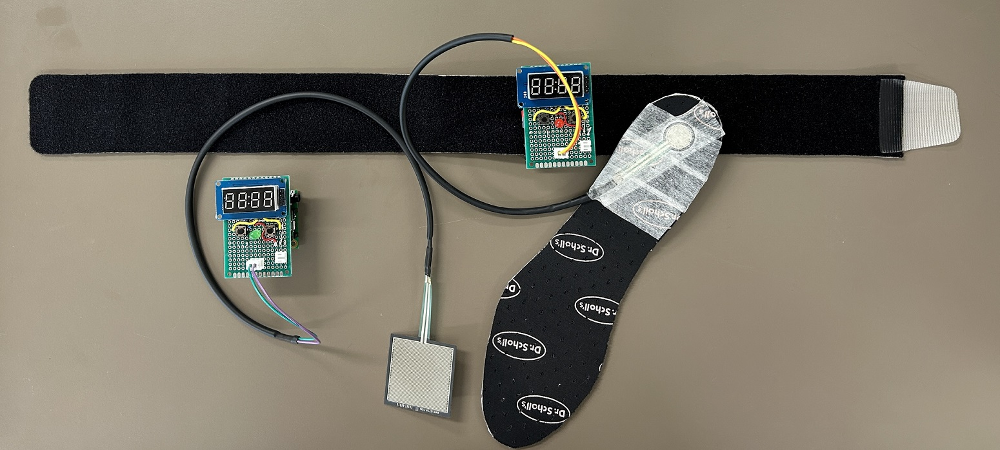

# TeensyStepTap

This project was developed with Teensy 4.0 and the Audio adapter board Rev D2.

Arduino IDE version: 1.8.19

Teensyduino version: 1.59

We can detect taps on an FSR and the cadence of a person walking by using a custom made sole with another FSR. The device displays conditions and useful info on a 4 digit LED. It is battery powered.

